# NestJS - Zero to Hero

## Requirements
* Download and install [node](https://nodejs.org/en/download/)
* Install `yarn` with `npm`:
```
$ npm install --global yarn
```
Or with `brew` for MacOS:
```
$ brew install yarn
```

* Install `nestjs` cli
```
$ yarn global add @nestjs/cli
```
* Install [postman](https://www.postman.com/downloads/)

#### Libs:
`uuid`:

```shell
$ yarn add uuid
```
### App Structure
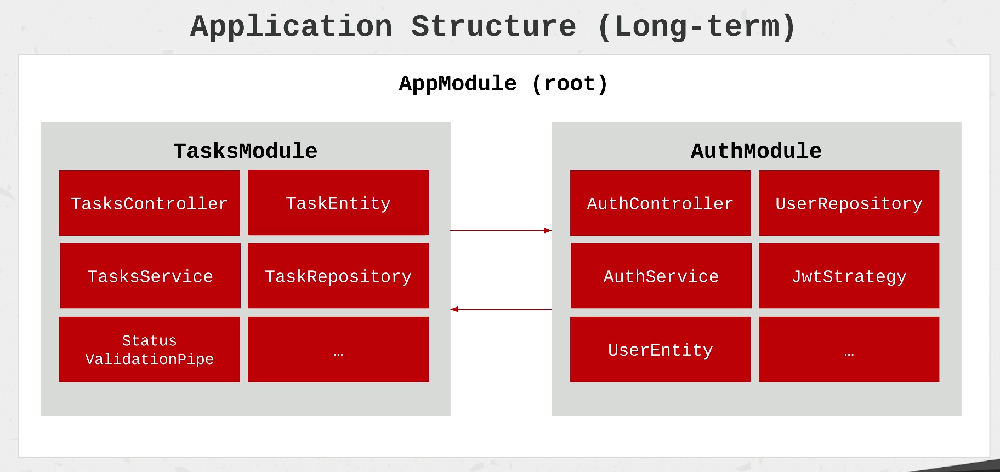

### Endpoints


## Get Started
```shell
$ nest -v nestjs-task-mamagement
```
and the choose `yarn`

This will create the project structure that looks like this
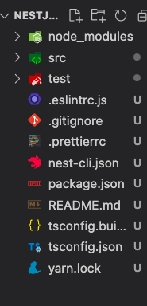

* `json` files are configuration files
* `src` include all the source files, and the main is the `main.ts`
* `AppModule` in `main.ts` is our `rootmodule`


## NestJS Modules
* Each app has at least one module - the root module
* Have a folder per module
* It's define by annotatinf a class with the `@Module` decorator
* `providers`, `controllers`, `exports` and `imports` are decorator properties

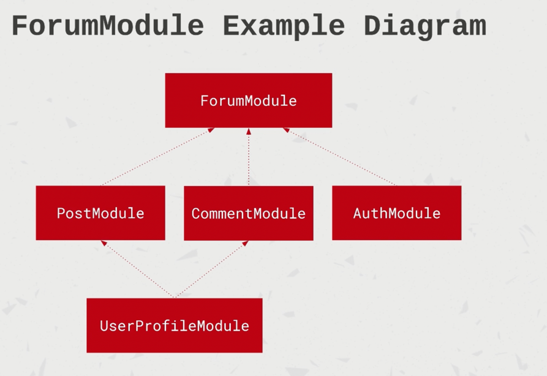
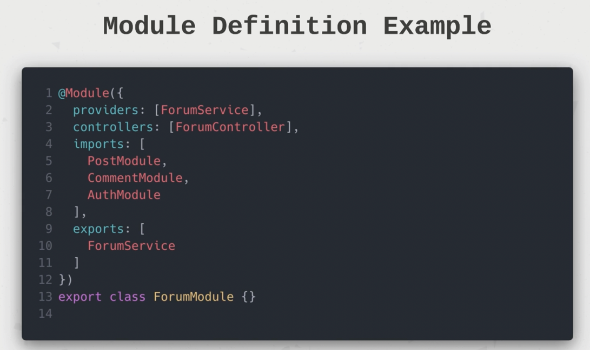

## Create a schematic with NestJS CLI
Modules are _schematics_, and we can create one by running:
```shell
$ nest g module tasks
```
This will generate one in the `app.modules` file of the project

#### Run the app
Run the standard `npm` command in development mode
```shell
$ yarn start:dev
``` 

## Controllers
* Handle requests and return responses
* Bound to specific path (like `/tasks`)
* Contain `handlers` - handle endpoints and request methods
* Defined with the `@Controller`

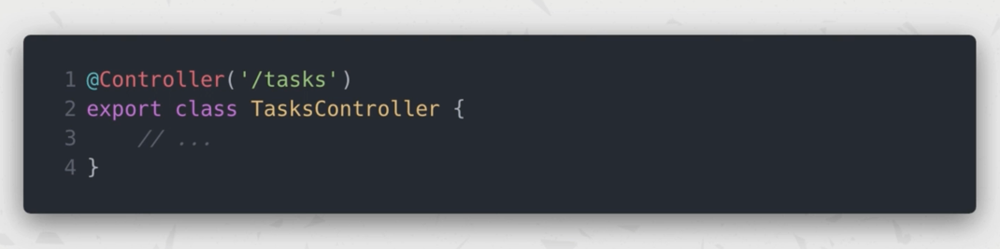

* Define a handler by using `@Get`, `@Post` etc

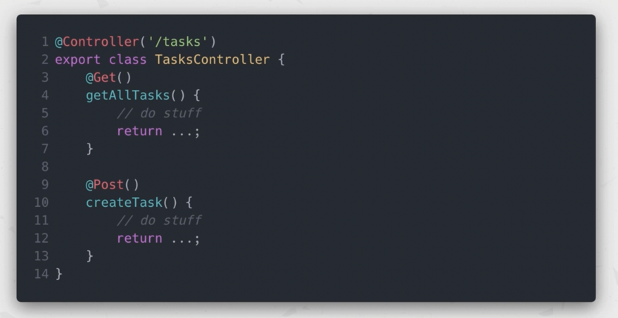

Create a controller with nest cli:
```shell
$ nest g controller tasks
```
#### Examples
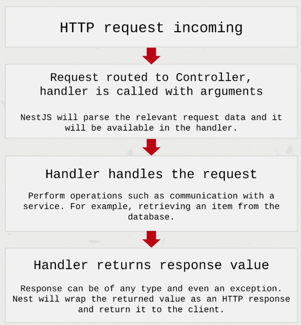
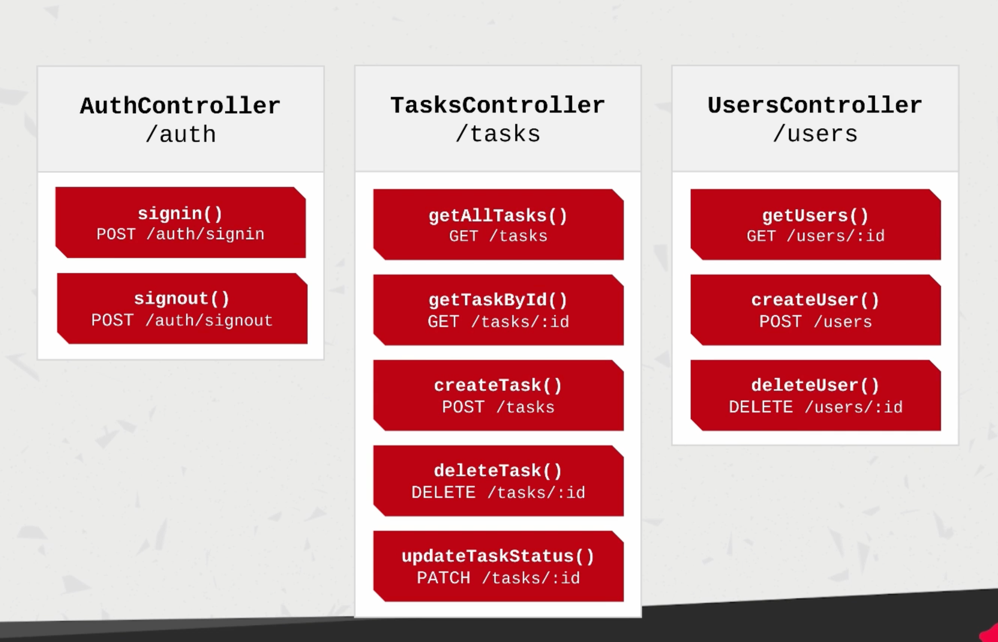


## NestJS Providers
* Can be injected in constructors if decorated with `@Injectable`
* Can be whatever
* Must be provided to a module
* Can be exported from a module

## Services
* Implemented using providers - not all providers are services
* Can be impolemented as singleton, wrapped with `@Injectable`
* It's the main source of bussines logic

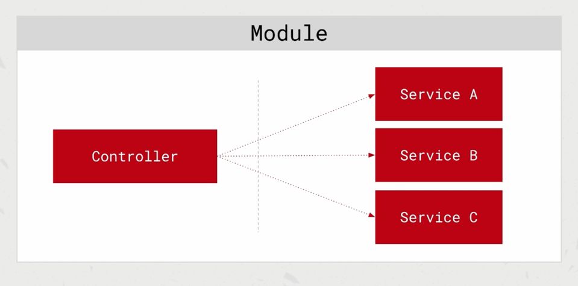
This is how services are injectable to a controller (through importing into modules and adding them into `providers:`)
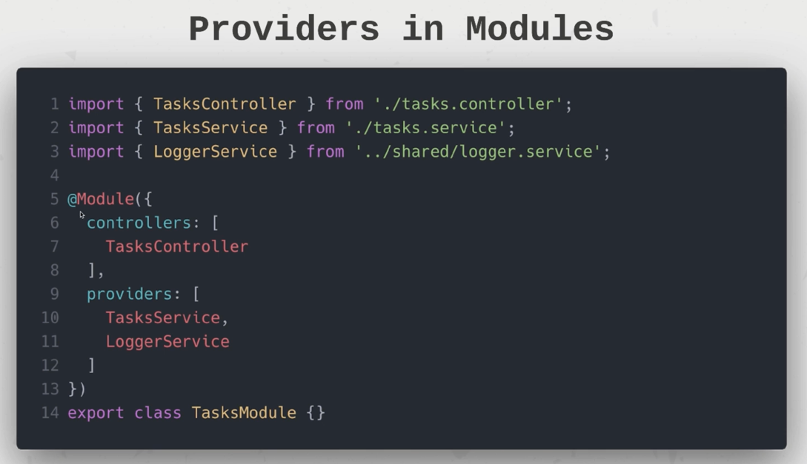

Create services by runing
```shell
$ nest g service tasks --no-spec
```

## Dependency Injection
* Any component can inject a provider that is decorated with `@Injectable`
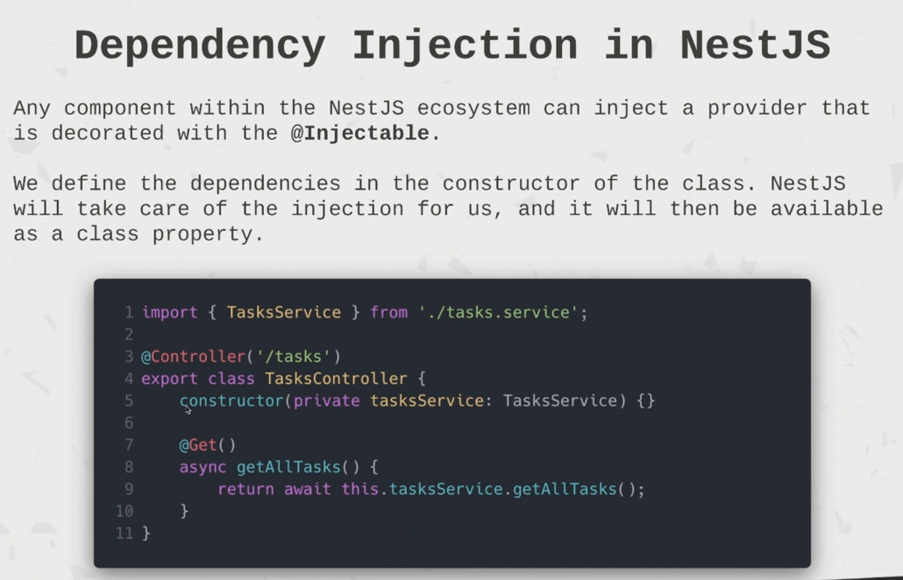

## Interfaces vs Classes
* Interfaces help us creating an object, but won't exist once the object is impolemented
* Classes do, and we can also add methods as well

That how all above work together
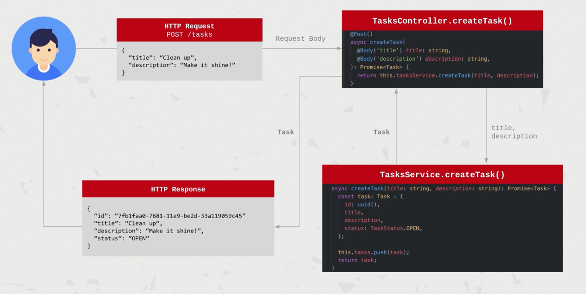

## Data Transfer Objects (DTO)
* In order to not change impoementations in different places, we can use DTO so we can changes things like types from a single place. DTO defined how data will be transfered over a network.
* Don't have any behavios. only serialization or deserialization
* Is not a model, only defines the shape of data, can be as simple as 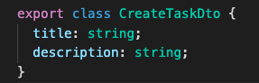
* Can be defined with interfaces or classes (better classes as they allow more and wil be preserved on runtime).
* Can be used throughout a project
* Useful to validate data too

#### Example
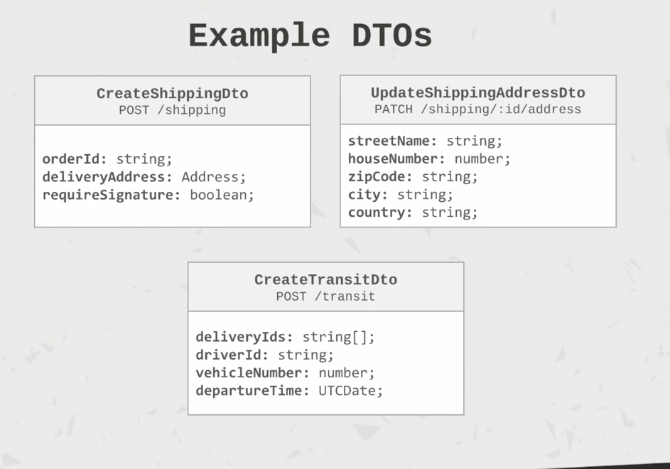

### Notes
> `3000` is the standard port for the node applications - makes our nextjs server up and running

> `eslint` is the linter that we're using